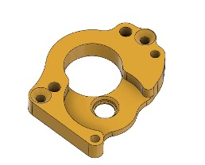
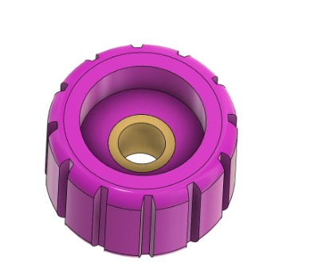
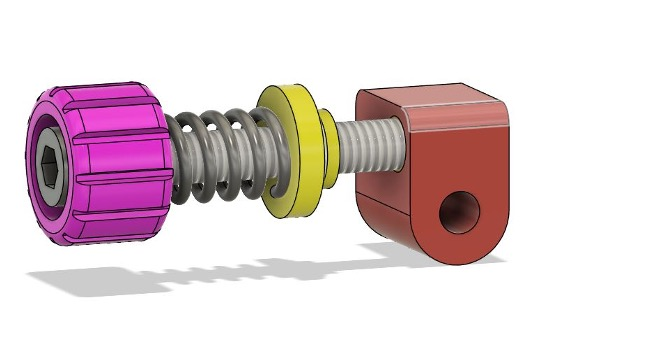

# Thumper V2

## Introduction
Thumper is a direct drive 3D printing extruder intended to offer some different features and characteristics to other existing extruders in the community.
Thumper is designed to use the same Bondtech BMG + 5:1 gear reduction set as several other popular extruders like the Sherpa, Sailfin, and Clockwork (among others).
With that in mind, one of the main design considerations for Thumper was to create a very rigid piece of hardware capable of undergoing dynamic force/pressure changes with little to no strain.
While this does make Thumper a little heavier than some options, it does help to produce very consistent extrusion and handles accelerations very well with no need to SLS print, machine, or SLM components. 

On top of this, Thumper V2 is designed with an integrated filament runout sensor (using a non-contact IR limit switch) that is placed in such a way that filament can be retracted far enough to grab after tripping.
This decision was made to simplify the hardware needed for filament runout detection, reduce the friction on the filament, eliminate wear and tear on limit switches, and reduce filament path complexity.
The approach does have some downsides; mainly that it adds a small amount of hotend mass, limits compatibility with IR transparent filament, and requires machine retraction to remove the remaining filament.

Finally, Thumper was designed to be cheap.
All of the components of thumper can be sourced from sites like Aliexpress, Amazon, and your local hardware store for relatively cheap, which makes thumper a good budget alternative to something like an Orbiter 2.

## Licensing
This extruder is licensed under CC-NC-A terms, meaning that individuals and businesses are permitted to use this design in their own machines for unlimited use at no cost, as well as modify or derive the design as needed as long as Attribution is given.
Additionally, sale of this extruder is not allowed outside of expressed consent by ThatOneGuy/Causality Manufacturing LLC. Low cost/flexible licensing terms are available for any businesses or individuals who wish to use this design in a printer design that they intend to market and sell. 

A full license file can be found in the zip folder wherever you downloaded the design from.

## Tips and Suggestions
Like with most printer parts, I suggest printing the components of this extruder out of either ASA or ABS.
Both of these materials combine good toughness, creep resistance, and temperature resistance in such a way that they are ideal for 3D printer components.
While something like PLA can work, PLA parts often fail faster due to fatigue or overtemperature induced creep.
If you cannot print ABS or ASA, PETG is a reasonable choice to get a useable extruder.
If you need components printed for your extruder or machine build from higher performance materials, feel free to reach out with a request.

For chamber temperatures exceeding 80C, higher temp resistance materials may be needed than ASA or ABS.
A few good choices for this are PA6-CF, PPA, or PPS.
Additionally, active cooling may be recommended for
the motor if not isolated from extremely high temperatures.
If you are experimenting with chamber temperatures past 100C, please do your research on motor insulation class and other temperature related considerations.

This extruder is designed to be fairly high tolerance. I highly suggest printing a few tolerance tests and ensuring that your machine can achieve 0.2mm clearance or less before printing.
Additionally, all through holes for screws should be drilled/reamed out to 3mm, and the filament path should be (carefully) reamed out to 2mm.
If you have issues fitting the PTFE tube segments (which should be 4mm OD), consider carefully reaming those.
I would suggest reaming with a drill bit clamped into a tapping handle if you have one.
Ream slowly and with gentle force to avoid cracking or melting components.
Small amounts of ethanol work well to cool the bit and lubricate the cutting area without causing a mess to clean up later.

# Build Instructions

## Tools required

|                           |               |
| ------------------------- | ------------- |
| Soldering Iron            | Required      |
| Allen Keys                | Required      |
| Heatset Soldering Tip     | Recommended   |
| Drill Bits (2mm & 3mm)    | Recommended   |
| Drill bit handle          | Recommended   |

The Allen Keys need to fit your sourced screws.  
You can use a powered drill as well with the requirement that you use it on a very slow speed.

## Parts
Before proceeding, check to make sure that you have all of the correct printed parts (especially if disassembling your current extruder for components to build this one). 
Off the shelf parts are found in the [BOM](https://docs.google.com/spreadsheets/d/1SlgQEobs8GpUgC1vk9rLLB1YgPafcE0acxdChgo-cXE/edit?usp=sharing).
One of each of the following parts is required.

| Main Body | Motor Plate |
| --- | --- |
|  |  |

| Reaction Disk | Lever Body|
| --- | --- |
|  |  |

| Latch Pivot | Tensioner Knob|
| --- | --- |
|  |  |

## Step 1 - Adding Threaded Inserts

Threaded inserts are set into 4.25mm holes, and should be gently pressed in until flush with the surface of the part.
Any excess ooze that disrupts the flat surface should be trimmed away. 
The position for each threaded insert is depicted here (as bronze colored cylinders).

##### Note, if you have not added threaded inserts before, I highly recommend you watch a good tutorial on youtube and print out a practice piece to add some inserts into. Included in the CAD folder of this extruder is a part that can be printed to practice with. Inserts can be removed and reused by threading in an M3 bolt and heating while pulling.

## Step 2 - Preparing the Motor Plate & Install the Bearing

Drill out all remaining 3mm holes (without inserts installed) with a 3mm drill bit.
Check with a M3 screw to make sure that threads slip through the holes without binding.

After drilling, carefully press one of the 8mm bearings into the bearing hole.
Place the plate flat on a firm surface and press with even force to insert the bearing.
If you cannot press it in with your fingers, you can carefully press with the back of a screwdriver handle to get stubborn fitting bearings into place.

## Step 3 Installing the Motor and checking the Gear Mesh

Be sure to install the motor with your wire leads in the desired direction for your toolhead strain relief.
Start both screws threading before you tighten them down all the way.
If you encounter any resistance when tightening, check to make sure there is nothing in the way of the part and that there are no signs of potential damage. 

Ensure that the screws are flush or under the top surface of the mounting plate to avoid fitup issues later on.

Insert the 50T gear (with 5mm live shaft) into the bearing and hold it vertically relative to the surface of the part.
Check to make sure that the gear properly meshes with the motor pinion.
The fit should look similar to the following images.
Additionally, make sure that the gears are roughly in the same plane as each other.
If the motor pinion does not line up with the gear, check your assembly and print tolerances to make sure there is nothing out of place.

")

If it is not already installed on the 5mm shaft, install the filament drive gear in the following orientation (with the set screw tigtened directly into the shaft flat spot)

## Step 4 - Installing the Filament Runout Sensor and the remaining Bearing

This bearing is less acessible to press in by hand than the previous bearing.
You can use the 50T gear/5mm shaft combination depicted above to gently press the bearing into place.
Be sure to only push on the center shaft doing this, pushing on the 50T gear can cause damage.

After this bearing is pressed into place, install the filament sensor using two M3 screws.
Ideally M3x8 button head screws would be used here, however to save cost the BOM uses m3x10F screw with a small 3D printed conformal washer to distribute pressure.
With both options it is important to not over-tighten.

## Step 5 - Assembling the Main Structure

#### Remember to insert the 50T gear assembly before connecting both pieces together. The shaft will also help with aligning the screw holes properly.

Using 2x M3x10F screws, connect the motor plate with motor attached to the main body.
As with all multi-screw operations, get both screws started before fully tightening down and check for issues if you encounter unexpected resistance.
Over-tightening can cause damage to the printed parts.

## Step 6 - Assembling the Lever

The idler gear is held into the lever mechanism with a press fit 3mm shaft.
To insert the idler, place the 3mm shaft inside of the needle roller bearings and idler gear.
Ensure that the larger gear teeth are facing the closed side of the 3mm shaft supports, and gently press/rock the shaft into place.
The idler gear should be free spinning after this.

Attach the lever to the rest of the extruder using one of the M3x25F screws.
Do not over tighten this screw, as it may cause the lever to bind instead of freely rotating.

At this point, you should test to make sure that the drive gears properly spin together by spinning the 50T gear through the side of the housing and check to make sure they grip filament when the lever is held in the closed position.

## Step 7 - Assembling the Latch

The latch is designed to control tension on the filament and allow for easy opening and closing of the extruder for tool-less maintenance.

To assemble the latch, start by screwing the tensioning knob hollow side first onto the M3x30 socket head screw.

| | |
| - | - |
|  |  |

After this, slide the spring and the reaction disk over the screw, before screwing the Latch Pivot onto the end.
Optionally, you can add a small tube (under 4.5mm OD) between the reaction plate and the latch pivot, which makes it easier to manipulate the latch without the reaction plate sliding past the lever.

| | |
| - | - |
|  |  |

Finally, the latch can be attached using the final M3x25F screw.
To tighten the latch, rotate the purple knob clockwise to compress the sprint into the lever.

## Wrapping it up

Your completed Thumper Mini should look like the following images and be able to open/close freely.

To attach to your chosen hotend/toolhead, use button or socket head M3 screws, which may vary in length depending on the specific design you choose.

For any questions or suggestions on revisions to this toolhead (along with ordering printed parts kits out of ASA, PA6, PPA, or SLS Nylon 12) feel free to reach out to HowardB@causalitymfg.com or contact "thatoneguy9242" on Discord.

